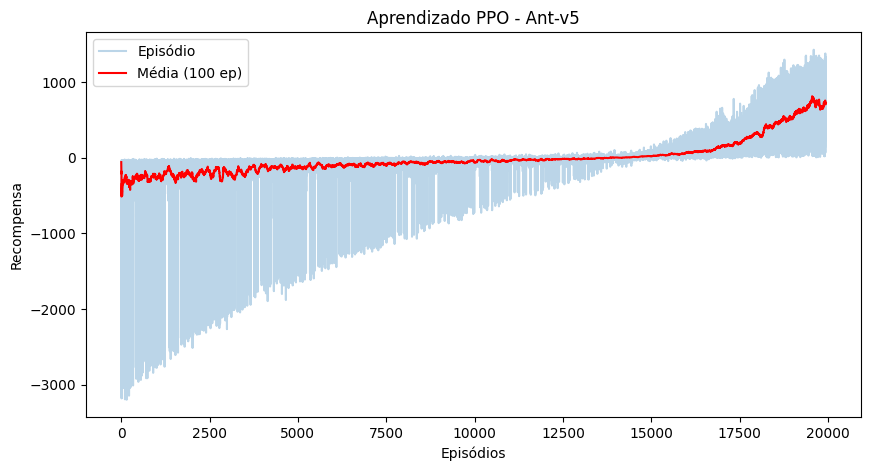

[README.md](https://github.com/user-attachments/files/29253044/README.md)
# 🐜 Ant-v5 — Controle de Robô Quadrúpede com PPO

**Disciplina:** Aprendizado por Reforço  
**Instituição:** Universidade Federal do Rio Grande do Norte (UFRN) — Metrópole Digital  
**Professora:** Tarciana Guerra  
**Autora:** Nathalia Marques  

---

## 📋 Descrição do Projeto

Este projeto implementa o algoritmo **PPO (Proximal Policy Optimization)** do zero para treinar um agente a controlar o robô quadrúpede **Ant-v5** do simulador MuJoCo. O objetivo do agente é aprender a coordenar simultaneamente 8 juntas motorizadas, 2 por perna (quadril e tornozelo), para fazer o robô caminhar para frente de forma estável e eficiente, sem cair.

O problema se enquadra na categoria de **sistemas dinâmicos e robótica avançada**: envolve controle de múltiplos atuadores, equilíbrio sob condições instáveis e física tridimensional realista.

---

## 🤖 O Ambiente — Ant-v5

O Ant é um robô quadrúpede 3D composto por:
- 1 torso central (corpo livre com 6 graus de liberdade)
- 4 pernas, cada uma com 2 partes articuladas (coxa + perna)
- 8 juntas motorizadas (hinges) conectando as partes


### Espaço de Observação

O agente recebe um vetor de **105 dimensões** a cada timestep:

| Componente | Dimensões | Descrição |
|---|---|---|
| `qpos` | 13 | Posição e orientação (quaternion) do torso + ângulos das 8 juntas |
| `qvel` | 14 | Velocidades lineares/angulares do torso + velocidades das juntas |
| `cfrc_ext` | 78 | Forças de contato externas em cada uma das 13 partes do corpo |

> As coordenadas x,y absolutas do torso são excluídas por padrão, tornando a política independente da posição — apenas o progresso relativo importa.

### Espaço de Ações

```
Box(-1.0, 1.0, (8,), float32)
```

8 valores contínuos representando o torque aplicado em cada junta:

| Índice | Junta | Perna |
|---|---|---|
| 0 | hip_4 | Traseira direita |
| 1 | angle_4 | Traseira direita |
| 2 | hip_1 | Frontal esquerda |
| 3 | angle_1 | Frontal esquerda |
| 4 | hip_2 | Frontal direita |
| 5 | angle_2 | Frontal direita |
| 6 | hip_3 | Traseira esquerda |
| 7 | angle_3 | Traseira esquerda |

### Função de Recompensa

```
reward = healthy_reward + forward_reward − ctrl_cost − contact_cost
```

| Termo | Descrição | Peso padrão |
|---|---|---|
| `healthy_reward` | +1 por timestep que o robô permanece em pé | 1.0 |
| `forward_reward` | Proporcional ao deslocamento para frente (Δx/dt) | 1.0 |
| `ctrl_cost` | Penaliza torques excessivos: `0.5 × Σ(ação²)` | 0.5 |
| `contact_cost` | Penaliza forças de contato elevadas | 5e-4 |

### Condição de Término

O episódio termina quando:
- A altura do torso (z) sai do intervalo saudável `(0.2, 1.0)` — o robô caiu
- Qualquer valor do estado se torna inválido (NaN/Inf)
- Truncamento após **1000 timesteps**

---

## 🧠 Algoritmo — PPO (Proximal Policy Optimization)

O PPO foi escolhido por três motivos principais:

1. **Espaço de ações contínuo de alta dimensão**: o Ant exige controle simultâneo de 8 ações contínuas, o que o PPO gerencia bem via política gaussiana
2. **Estabilidade**: o mecanismo de *clipping* limita o quanto a política pode mudar por atualização, evitando o colapso de política comum em algoritmos on-policy mais simples como o A2C
3. **Técnica de estabilização exigida**: atende ao requisito de implementar *Clipping* como técnica de mitigação de desafios de aprendizado profundo

### Arquitetura das Redes Neurais

**Actor** — define a política: dado um estado, retorna uma distribuição gaussiana sobre as 8 ações

```
Entrada (105) → Linear(128) → ReLU → Linear(128) → ReLU → mean_layer(8)
                                                          → log_std (parâmetro treinável)
```

**Critic** — estima o valor V(s): dado um estado, retorna o retorno esperado

```
Entrada (105) → Linear(128) → ReLU → Linear(128) → ReLU → Linear(1)
```

### Mecanismo de Clipping (coração do PPO)

```python
ratio = exp(log_prob_nova − log_prob_antiga)

surr1 = ratio × advantage
surr2 = clip(ratio, 1 − ε, 1 + ε) × advantage

actor_loss = −min(surr1, surr2)
```

O `clip_epsilon = 0.2` garante que a razão entre a política nova e a antiga nunca ultrapasse o intervalo `[0.8, 1.2]`, impedindo atualizações destrutivas.

---

## ⚙️ Hiperparâmetros

| Parâmetro | Valor | Descrição |
|---|---|---|
| `total_timesteps` | 3.000.000 | Total de interações com o ambiente |
| `timesteps_per_batch` | 8192 | Passos coletados antes de cada atualização |
| `max_steps_per_episode` | 1000 | Limite de passos por episódio |
| `lr_actor` | 1e-4 | Taxa de aprendizado do Actor |
| `lr_critic` | 5e-4 | Taxa de aprendizado do Critic |
| `gamma` | 0.99 | Fator de desconto |
| `ppo_epochs` | 10 | Épocas de atualização por lote |
| `mini_batch_size` | 128 | Tamanho do mini-batch |
| `clip_epsilon` | 0.2 | Limite do clipping PPO |
| `hidden_size` | 128 | Neurônios nas camadas ocultas |

---

## 📊 Resultados

### Curva de Aprendizado




| Fase | Episódios | Comportamento |
|---|---|---|
| Exploração caótica | 0 – 1000 | Recompensas chegando a -3000, robô caindo frequentemente |
| Estabilização | 1000 – 2500 | Média sobe de -300 para próximo de 0 |
| Aprendizado consistente | 2500 – 4000 | Média cruza o zero e sobe continuamente |
| Convergência | 4000 – 5100 | Média atinge +600, robô aprendeu a caminhar |

### Comportamento Aprendido

Ao final do treinamento, o robô demonstrou:
- ✅ Manter-se em pé durante todo o episódio (1000 timesteps / ~34 segundos)
- ✅ Coordenar as 4 pernas de forma sincronizada
- ✅ Avançar continuamente para frente sem cair
- ✅ Episódio completo encerrado por truncamento, não por queda

---

## 🗂️ Estrutura do Repositório

```
ant-v5-ppo/
│
├── ANT-v5_PPO.ipynb       # Notebook principal com todo o código
├── README.md              # Este arquivo
│
├── ant_models/
│   └── actor_final.pth    # Pesos do Actor treinado
│
└── ant_videos/
    └── ant_final_eval.mp4 # Vídeo do agente após o treinamento
```

---

## 🚀 Como Executar

### Pré-requisitos

```bash
# Dependências do sistema (necessário no Google Colab)
apt-get install -y libosmesa6-dev libgl1-mesa-glx libglfw3 mesa-utils

# Dependências Python
pip install gymnasium[mujoco] moviepy imageio[ffmpeg] torch
```

### Configuração do ambiente gráfico (Google Colab)

```python
import os
os.environ['MUJOCO_GL'] = 'osmesa'
os.environ['PYOPENGL_PLATFORM'] = 'osmesa'
```

### Execução

1. Abra o arquivo `ANT-v5_PPO.ipynb` no Google Colab
2. Execute as células na ordem
3. O treinamento inicia automaticamente ao rodar a célula de execução
4. Ao final, o vídeo do agente treinado é exibido no próprio notebook

---

## 📚 Referências

- [Gymnasium — Ant-v5 Documentation](https://gymnasium.farama.org/environments/mujoco/ant/)
- Schulman, J. et al. (2017). *Proximal Policy Optimization Algorithms*. arXiv:1707.06347
- Schulman, J. et al. (2015). *High-Dimensional Continuous Control Using Generalized Advantage Estimation*. arXiv:1506.02438
- MuJoCo Physics Simulator — [mujoco.org](https://mujoco.org)
